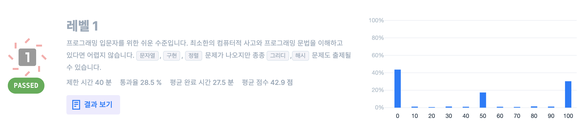

# Level Test



For beginners, The problems can be solved with basic programming skills. That contains `strings`, `implementation`, `sort`. Sometimes it can come out `greedy` and `hash`.

* Time Limit: 40 minutes
* Pass Rate: 28.5 %
* Average Complete Time: 27.5 minutes
* Average Score: 42.9 score


# Practice

## Algorithm

## SQL

### SELECT


```sql
-- 1. select all
SELECT * FROM ANIMAL_INS;
-- 2. order by desc
SELECT NAME, DATETIME FROM ANIMAL_INS ORDER BY ANIMAL_ID DESC;
-- 3. where condition ==
SELECT ANIMAL_ID, NAME FROM ANIMAL_INS WHERE INTAKE_CONDITION = 'Sick' ORDER BY ANIMAL_ID ASC;
-- 4. where condition !=
SELECT ANIMAL_ID, NAME FROM ANIMAL_INS WHERE INTAKE_CONDITION != 'Aged' ORDER BY ANIMAL_ID ASC;
-- 5. order by asc
SELECT ANIMAL_ID, NAME FROM ANIMAL_INS ORDER BY ANIMAL_ID ASC;
-- 6. order by multi condition
SELECT ANIMAL_ID, NAME, DATETIME FROM ANIMAL_INS ORDER BY NAME ASC, DATETIME DESC;
-- 7. select top n
SELECT NAME FROM ANIMAL_INS ORDER BY DATETIME ASC LIMIT 1;
```
